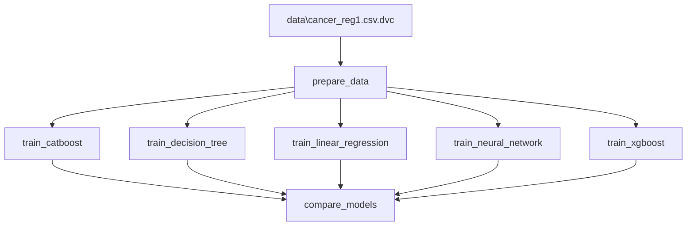

# Анализ данных и реализация нескольких моделей для предсказания целевой велечины
Целью данной работы является получение навыков анализа данных, определения признаков взаимосвязи (EDA), реализации на языке Python моделей: линейной регрессии, дерева решений, CatBoost, XGBoost, нейронной сети (MLP).
## Подготовка датасета
В качестве задания стоит предсказание смертности от рака в зависимости от различных параметров, представленных подробно в файле [Annotation.md](Annotation.md). В частности, это информация о месте проживания людей, о качестве медицины и личная информация людей (раса, работа, семейный статус и т.д.).  
Данные были собраны Ноа ([ссылка](https://data.world/nrippner/ols-regression-challenge)) из многочисленных источников, а именно из American Community Survey (census.gov), clinicaltrials.gov и cancer.gov.

Вручную были удалены столбцы, сложные для интерпритации (Медианный доход на душу населения в разбивке по децилям), а также столбцы обладающие большим количеством пропусков (больше 50%) (Процент жителей округа в возрасте 18-24 лет, получивших высшее образование: некоторый колледж). Данные по округам и штатам также были удалены,  так как правильное территориальное деление слишком трудозатратно.

## Тепловые карты
Для первичного определения зависимостей можно построить **тепловую карту** - это удобное отображение коррелирующих между собой параметров. Сначала построена тепловая карты для всех параметров.

  

Далее выделены признаки, корреляция с целевой переменной у которых более 30% по модулю.

Основными наиболее линейно влияющими признаками являются:
- Процент людей, окончивших бакалавриат и процент людей, окончивших 11 класов
- Процент бедности
- Медианный доход
- Среднее количество диагнозов
- Процент людей старше 16, имеющих работу (влияет на смертность отрицательно) и процент людей старше 16 не имеющих работу (влияет на смертность положительно)

**ВАЖНО**, что между признаками могут быть нелинейные зависимости, которые на тепловой карте не отобразятся, что отразится на точности предсказания моделей.

## Построение моделей
Целью работы является сравнение работы нескольких моделей по предсказанию целевой переменной - смертности от рака на душу населения. Качество предсказаний моделей будет определяться по следующим метрикам:

- **R² (коэффициент детерминации):** Показывает, насколько хорошо модель объясняет данные. Чем ближе к 1, тем лучше. R² = 0.90 означает, что модель объясняет 90% вариации целевой переменной.
- **MAE (средняя абсолютная ошибка):** Средняя абсолютная величина ошибки в единицах целевой переменной. MAE = 5.62 означает, что модель ошибается в среднем на 5.62 смертей на 100 000 населения.
- **RMSE (корень из среднеквадратичной ошибки):** Аналогичен MAE, но сильнее штрафует за большие ошибки. Используется, когда важна чувствительность к выбросам.

Сравниваемые модели описаны ниже.

### Линейная регрессия
Линейная регрессия моделирует зависимость целевой переменной от признаков в виде линейной комбинации, где коэффициенты интерпретируются как мера влияния каждого признака: положительные значения указывают на прямое влияние, отрицательные — на обратное. Модель отличается высокой скоростью обучения, простотой интерпретации и устойчивостью к переобучению при достаточном количестве данных. Однако ее главное ограничение заключается в неспособности улавливать сложные нелинейные паттерны и взаимодействия между признаками, что делает ее непригодной для задач со сложными зависимостями.

В этой модели всего 2 гиперпараметра:
- positive - поиск коэффициентов только с положительным знаком.
- fit_intercept - добавление свободного члена в уравнение.

Полином, полученный с помощью линейной регрессии представлен в файле [linear_regression_equation.txt](support_files\linear_regression_equation.txt). Он представлен для ненормированных значений параметров.

Метрики для линейной регрессии:

| linear_regression | R2   | RMSE | MAE  |
|------------|------|------|------|
| train      | 0.81 | 12.15| 7.99 |
| validation | 0.78 | 12.73| 8.62 |
| test       | 0.76 | 12.83| 8.57 |

### Дерево решений
Дерево решений последовательно разбивает пространство признаков на однородные области с помощью серии бинарных вопросов, формируя иерархическую структуру, где каждый лист содержит предсказанное значение целевой переменной. Данный подход позволяет модели естественным образом улавливать нелинейные зависимости и взаимодействия между признаками, а также обеспечивает прозрачность внутреннего устройства, поскольку дерево можно визуализировать и интерпретировать. Тем не менее, деревья решений крайне чувствительны к малым изменениям в данных и склонны к серьезному переобучению, если не ограничивать их глубину или не использовать ансамблевые методы.

Гиперпараметрами дерева решений является:
- max_depth - глубина, сложность дерева
- min_samples_split - минимальное количество объектов в узле, чтобы его можно было разделить дальше
- min_samples_leaf - минимальное количество объектов в листе (конечном узле)

Структура, получащаяся в результате обучения дерева решений представлена ниже.

Метрики для дерева решений:

| decision tree    | R²   | RMSE  | MAE   |
|------------|------|-------|-------|
| train      | 0.83 | 11.27 | 7.79  |
| validation | 0.74 | 13.83 | 9.59  |
| test       | 0.77 | 12.69 | 9.23  |

### XGBoost
XGBoost — это высокоэффективная реализация градиентного бустинга, которая стала стандартом в соревнованиях по машинному обучению благодаря скорости, точности и гибкости. Алгоритм строит ансамбль деревьев последовательно, используя регуляризацию L1 и L2 для контроля сложности модели, а также эффективные параллельные вычисления и оптимизированную работу с разреженными матрицами. XGBoost требует более тщательной настройки гиперпараметров по сравнению с CatBoost, но при правильном подборе параметров часто демонстрирует наилучшее качество среди всех градиентных бустингов.

Гиперпараметры XGBoostа:
- n_estimators - количество деревьев в ансамбле
- learning_rate - шаг градиентного спуска, как быстро каждое новое дерево учится на ошибках предыдущих
- max_depth - глубина каждого дерева в ансамбле
- reg_alpha - L1 регуляризация. Обнуляет малозначимые признаки 
- reg_lambda - L2 регуляризация. Уменьшает все коэффициенты, не обнуляя их
- eval_metric - метрика для ранней остановки. Для предсказания типичные - rmse, mae

Метрики для XGBoost:

| XGBoost    | R²   | RMSE | MAE  |
|------------|------|------|------|
| train      | 1.00 | 1.64 | 1.19 |
| validation | 0.85 | 10.47| 6.58 |
| test       | 0.90 | 8.38 | 5.88 |

Наиболее важными признаками оказались «смерти_на_диагнозы» (36.19) и «ср. кол-во диагнозов/д.н.» (20.85), что логично, так как они напрямую связаны с онкологической заболеваемостью и смертностью. Остальные признаки имеют значительно меньший вклад (менее 4%).

| Признак | Важность |
|---------|----------|
| смерти_на_диагнозы | 36.19 % |
| ср. кол-во диагнозов/д.н. | 20.85 % |
| высшее_образование_на_бедность | 3.51 % |
| уровень_занятости | 3.15 % |
| занятость_доход | 3.14 % |
| образование_доход | 2.37 % |
| без_страховки | 2.16 % |
| % >16 не работают | 1.99 % |
| Население графства | 1.94 % |
| % >16 работают | 1.49 % |

### CatBoost
CatBoost — это градиентный бустинг на деревьях решений, разработанный Яндексом и оптимизированный для работы с категориальными признаками, которые алгоритм обрабатывает автоматически с помощью упорядоченного кодирования. Модель строит ансамбль деревьев последовательно, где каждое новое дерево обучается исправлять ошибки предыдущих, используя симметричные деревья и механизм упорядоченного бустинга для предотвращения переобучения. Основными преимуществами являются высокое качество даже при настройках по умолчанию, устойчивость к переобучению и минимальные требования к предобработке данных.  

Гиперпараметры CatBoostа:
- iterations - количество деревьев в ансамбле
- learning_rate - шаг градиентного спуска, как быстро каждое новое дерево учится на ошибках предыдущих
- depth - глубина каждого дерева в ансамбле
- l2_leaf_reg - L2 регуляризация. Уменьшает все коэффициенты, не обнуляя их

Метрики для CatBoost:

| CatBoost    | R²   | RMSE | MAE  |
|------------|------|------|------|
| train      | 0.99 | 2.36 | 1.82 |
| validation | 0.88 | 9.46 | 6.10 |
| test       | 0.90 | 8.27 | 5.62 |

CatBoost, как и XGBoost, выделяет два ключевых признака: «смерти_на_диагнозы» (39.57) и «ср. кол-во диагнозов/д.н.» (34.85), которые в сумме дают более 74% важности. Остальные признаки имеют незначительный вклад (менее 4% каждый).

| Признак | Важность |
|---------|----------|
| смерти_на_диагнозы | 39.57 % |
| ср. кол-во диагнозов/д.н. | 34.85 % |
| образование_доход | 3.16 % |
| ср. кол-во рака в г. | 1.48 % |
| без_страховки | 1.39 % |
| высшее_образование_на_бедность | 1.13 % |
| % 18-24 оконч. 11 классов | 1.10 % |
| % раса белые | 1.03 % |
| Население графства | 1.01 % |
| % >25 оконч. 11 классов | 0.99 % |

### Нейросеть
Многослойный перцептрон представляет собой полносвязную нейронную сеть с входным, одним или несколькими скрытыми слоями (с нелинейными функциями активации, такими как ReLU) и выходным линейным слоем для задачи регрессии. Сеть способна моделировать сколь угодно сложные нелинейные зависимости, обучаясь методом обратного распространения ошибки. Основными недостатками являются сложность интерпретации весов, чувствительность к масштабированию данных (требуется нормализация), большое количество гиперпараметров для настройки и относительно медленное обучение по сравнению с бустингами.

Гиперпараметры нейронной сети:
- epochs - максимальное количество проходов по всем данным
- batch_size - количество объектов в одном батче: после прохода по батчу обновляются веса
- learning_rate - шаг градиентного спуска для оптимизатора (Adam)
- layer_X_neurons - число нейронов в каждом скрытом слое
- activation - функция активации
- dropout_rate - процент нейронов, которые будут "выключаться"
- patience - кол-во эпох, после которых обучение остановится, если валидационная потеря не улучшится

Метрики для нейронной сети:

| NN    | R²   | RMSE | MAE  |
|------------|------|------|------|
| train      | 0.88 | 9.67 | 6.83 |
| validation | 0.82 | 11.47| 7.84 |
| test       | 0.86 | 9.83 | 7.24 |

Далее представлены графики кривых обучения: график потерь (loss). Значение ошибки на обучающей выборке, быстро снижается в первые эпохи и постепенно стабилизируется. Значение ошибки на валидационной выборке достаточно близки к обучающей кривой, что указывает на хорошее обобщение модели.

Гистограммы весов отображают распределение значений весовых коэффициентов в каждом слое нейронной сети после завершения обучения. На графиках представлены:
- dense_1 — веса первого скрытого слоя (64 нейрона)
- dense_2 — веса второго скрытого слоя (32 нейрона)
- dense_3 — веса третьего скрытого слоя (16 нейронов)

Широкое распределение на 1 слое говорит о том, что нейроны первого слоя обучаются разным признакам, сеть способна улавливать сложные зависимости. НА 2 и 3 слоях пик все ближе к 0 - регуляризация и dropout работает эффективно, многие нейроны "выключаются", предотвращая переобучение.

Также были получены графики из TensorBoard — это инструмент визуализации, который в реальном времени отображает процесс обучения нейронной сети. По сути отображает то же самое, что и гистограммы весов, но на каждой эпохе и красиво.

## Настройка и контроль гиперпараметров
Для отслеживания изменений гиперпараметров моделей будет использоваться DVC (Data Version Control) - инструмент для версионирования данных, моделей и метрик, который работает поверх Git, позволяя отслеживать большие файлы без их непосредственного хранения в репозитории. При изменении любой зависимости DVC автоматически определяет, какие этапы необходимо перезапустить, что обеспечивает детерминизм и воспроизводимость экспериментов.

В результате работы с DVC получен граф показывающий, как связаны между собой этапы пайплайна.

## Результаты работы
После нескольких попыток подбора гиперпараметров для моделей точность всех из них **не удалось сделать выше 50%** (Дерево решений и линейная регрессия не выдавали результатов выше 40%), в связи с чем было принято решение искать проблемы в методах подхода.

В первую очередь было принято решение вернуть "некоррелирующие" признаки. После этого точность Catboost, Xgboost и нейронной сети **удалось повысить до 60%**, но не выше (Дерево решений и линейная регрессия также не выдавали больше 40%). 

Далее было принято решение подобрать дополнительные признаки из заданных изначально (их было больше, но в работе остались только те, которые положительно влияли на точность предсказания моделей). Среди них:
- Отношение кол-ва смертей к кол-ву диагнозов
- % людей без страховки 
- Отношение дохода к % бедности
- Произведение дохода на % бедности
- % бедности в квадрате
- Произведение % не работающих после 16 лет людей на % бедности
- Произведение медианного дохода на % работающих после 16 лет людей
- Отношение % работающих после 16 лет людей к % не работающих после 16 лет людей
- Отношение % людей, окончивших бакалавр, к % бедности
- Произведение % людей, окончивших бакалавр, и медианного похода
- Отношение % людей, окончивших бакалавр, к проценту людей, окончивших 11 классов

Только после этого **модели смогли достичь точности выше 75%**.

Основные выводы по изменению гиперпараметров:
- Слишком большая глубина деревьев снижает точность предсказаний (10 уже много)
- Число деревьев в ансамблях повышает точность, но после некоторого значения рост слишком медленный, чтобы имело смысл усложнять модель
- В CatBoost есть только регуляризация L2, поэтому там ее высокое значение позволяет повысить точность. В XGBoost используется еще и регуляризация L1, поэтому можно использовать меньшие значения регуляризаций и добиться точности. 
- Увеличение числа эпох в нейронной сети приводило к ухудшению предсказаний. Небольшое увеличение learning_reate (изначально стояло 0.01, увеличено до 0.03) увеличило точность.

В результате удалось получить следующие метрики моделей:  
| Модель | R²_test | RMSE_test | MAE_test |
|--------|---------|-----------|----------|
| CatBoost | 0.900 | 8.269 | 5.625 |
| XGBoost | 0.898 | 8.381 | 5.884 |
| Нейронная сеть | 0.859 | 9.831 | 7.239 |
| Дерево решений | 0.765 | 12.688 | 9.226 |
| Линейная регрессия | 0.760 | 12.825 | 8.570 |

Данные о смертности от рака содержат множество взаимодействий между признаками (социально-экономическими, демографическими, медицинскими), которые носят **нелинейный характер**. Линейная регрессия не способна улавливать такие взаимодействия, что объясняет её низкий результат (R² = 0.760). CatBoost и XGBoost, напротив, строят ансамбли деревьев решений, которые естественным образом моделируют нелинейные зависимости и взаимодействия признаков.

Наличие **регуляризации** позволило градиентным бустингам достичь высокой обобщающей способности, в то время как дерево решений без регуляризации переобучилось. 

Нейронная сеть показала средний результат (R² = 0.859), вероятно из-за **ограниченного объёма данных**.

В результате выполнения работы были получены навыки преобработки данных, построения различных моделей для предсказания целевой переменной. Были получены навыки работы с DVC.
